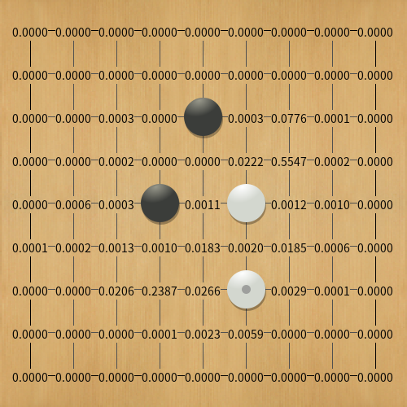

# TamaGo
TamaGoはPythonで実装された囲碁の思考エンジンです。  
SGF形式の棋譜ファイルを利用した教師あり学習、Gumbel AlphaZero方式の強化学習をお試しできるプログラムとなっています。  
学習したニューラルネットワークのモデルを使用したモンテカルロ木探索による着手生成ができます。  
Python 3.6で動作確認をしています。

* [使用する前提パッケージ](#requirements)
* [セットアップ手順](#installation)
* [思考エンジンとしての使い方](#how-to-execute-gtp-engine)
* [教師あり学習の実行](#how-to-execute-supervised-learning)
* [強化学習の実行](#how-to-execute-reinforcement-learning)
* [ライセンス](#license)

# Requirements
|使用するパッケージ|用途|
|---|---|
|click|コマンドライン引数の実装|
|numpy|雑多な計算|
|pytorch|Neural Networkの構成と学習の実装|

# Installation
Python 3.6が使える環境で下記コマンドで前提パッケージをインストールします。
```
pip install -r requirements.txt
```
CPUのみでも動作しますが、学習を実行する場合はGPUを使えるようセットアップすることをお勧めします。

# How to execute GTP engine
GTP対応のGUI (GoGui, Sabaki, Lizzieなど) を使用する場合は下記コマンドで思考エンジンとして使用できます。
```
python main.py
```
コマンドラインオプションとしては下記のものがあるので必要に応じて設定してください。コマンドラインオプションはclickを使用して実装しています。

| オプション | 概要 | 設定する値 | 設定値の例 | デフォルト値 | 備考 |
|---|---|---|---|---|---|
| `--size` | 碁盤のサイズ | 2以上BOARD_SIZE以下 | 9 | BOARD_SIZE | BOARD_SIZEはboard/constant.pyに定義してあります。|
| `--superko` | 超劫ルールの有効化 | true または false | true | false | Positional super koのみ対応しています。|
| `--model` | ネットワークモデルファイルパス | 学習済みモデルファイルパス | model/model.bin | なし | TamaGoのホームディレクトリからの相対パスで指定してください。指定がない場合はニューラルネットワークを使用せずにランダムに着手します。 |
| `--use-gpu` | GPU使用フラグ | true または false | true | false | |
| `--policy-move` | Policyの分布に従って着手するフラグ | true または false | true | false | Policyのみの強さを確認するときに使用します。 |
| `--sequential-halving` | Sequential Halving applied to treesの探索手法で探索するフラグ | true または false | true | false | 自己対戦時に使う探索なので、基本的にデバッグ用です。 |
| `--visits` | 1手あたりの探索回数 | 1以上の整数 | 1000 | 1000 | --const-timeオプション、または--timeオプションの指定があるときは本オプションを無視します。 |
| `--const-time` | 1手あたりの探索時間 (秒) | 0より大きい実数 | 10.0 |  | --timeオプションの指定があるときは本オプションを無視します。 |
| `--time` | 持ち時間 (秒) | 0より大きい実数 | 600.0 | |

## プログラムの実行例は下記のとおりです
1) 碁盤のサイズを5、model/model.binを学習済みモデルとして使用し、GPUを使用せずに実行するケース
```
python main.py --size 5 --model model/model.bin --use-gpu false
```
2) 超劫を着手禁止にするケース
```
python main.py --superko true
```
3) model/sl-model.binを学習済みモデルとして使用し、Policyの分布に従って着手を生成するケース
```
python main.py --model model/sl-model.bin --policy-move true
```
4) 持ち時間を10分にするケース
```
python main.py --time 600
```
5) 1手あたりの探索回数を500にするケース
```
python main.py --visits 500
```
6) 1手あたりの探索時間を10秒にするケース
```
python main.py --const-time 10.0
```

## 学習済みモデルファイルについて
学習済みのモデルファイルについては[こちら](https://github.com/kobanium/TamaGo/releases)から取得してください。modelフォルダ以下にmodel.binファイルを配置するとコマンドラインオプションの指定無しで動かせます。ニューラルネットワークの構造と学習済みモデルファイルが一致しないとロードできないので、取得したモデルファイルのリリースバージョンとTamaGoのバージョンが一致しているかに注意してください。  
Version 0.3.0時点のモデルはGNUGo Level 10に対して約+90elo(勝率63.5%)程度の強さです。モンテカルロ木探索で1手あたり100回探索すると、GNUGo Level 10に対して約+160elo(勝率71.8%)程度の強さです。  
Version 0.6.0からネットワークの構造を変更したため、以前のバージョンの学習済みモデルファイルは利用できません。

# How to execute supervised learning
教師あり学習の実行方法については[こちら](doc/ja/supervised_learning.md)をご参照ください。

# How to execute reinforcement learning
強化学習の実行方法については[こちら](doc/ja/reinforcement_learning.md)をご参照ください。

# GoGui analyze commands
[GoGui](https://sourceforge.net/projects/gogui/)を使用すると現局面のPolicyの値を表示したり、Policyの値の大きさに応じた色付けをできます。  
Policyの値は0.0〜1.0の範囲で表示されます。




Policyの値による色付けはPolicyの値が大きいほど赤く、小さいほど青く表示されます。


# License
ライセンスはApache License ver 2.0です。

# Todo list
- 碁盤の実装
  - [x] 連のデータ構造
  - [x] 3x3パターンのデータ構造
  - [x] 着手履歴
  - [x] Zobrist Hash
  - [x] Super Koの判定処理
- 探索部の実装
  - [x] 木とノードのデータ構造
  - [ ] モンテカルロ木探索
    - ~~クラシックなMCTS~~
      - ~~UCT~~
      - ~~RAVE~~
      - ~~ランダムシミュレーション~~
    - [x] PUCT探索
      - [x] PUCB値の計算
      - [x] ニューラルネットワークのミニバッチ処理  
    - [x] Sequential Halving applied to tree探索
    - [ ] CGOS対応
    - [x] 持ち時間による探索時間制御
- 学習の実装
  - [x] SGFファイルの読み込み処理
  - [x] 学習データ生成
    - [x] 教師あり学習のデータ生成
      - [x] 入力特徴生成
      - [x] Policyの生成
      - [x] npz形式での保存処理
    - [x] 強化学習のデータ生成
      - [x] 入力特徴生成
      - [x] Improved Policyの生成
      - [x] npz形式での保存処理
  - [x] PyTorchを利用した教師あり学習
  - [x] PyTorchを利用したGumbel AlphaZero方式の強化学習
- GTPクライアントの実装
  - 基本的なコマンド
    - [x] プログラム情報の表示 : name, version, protocol_version
    - [x] プログラムの終了 : quit
    - [x] 碁盤の操作 : boardsize, clear_board
    - [x] 碁盤の表示 : showboard, showstring
    - [x] 着手 : play, genmove
    - [x] コミの設定と取得 : komi, get_komi
    - [x] コマンドの確認 : known_command, list_commands
    - [x] SGFファイルの読み込み : load_sgf
  - 大会参加時に必要なコマンド
    - [x] 持ち時間の初期化 : time_settings
    - [x] 持ち時間の読み込み : time_left
  - 分析用のコマンド
    - [x] Policyの数値の表示
    - [x] Policyの分布を色で表示

etc...
